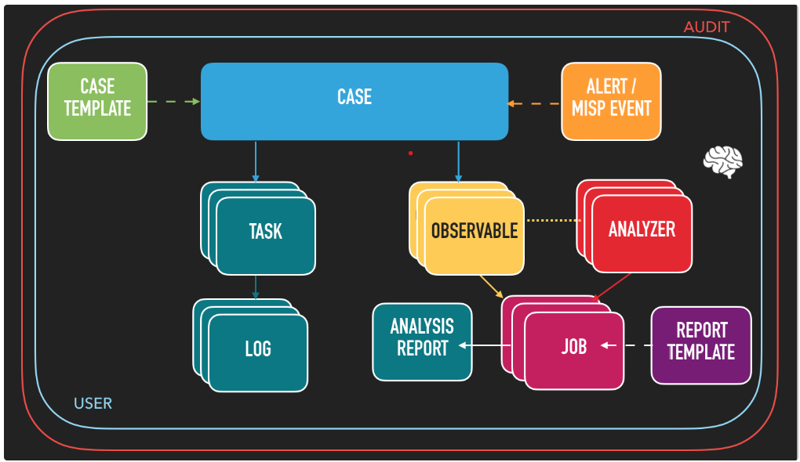

# The Hive Security Tool: A Scalable and Collaborative Platform for Security Incident Response

The Hive is a scalable and collaborative security incident response platform that allows organizations to manage and analyze security incidents in a structured manner. It provides a centralized platform for security teams to collaborate, investigate, and respond to security incidents effectively.

The project report details the development and use of TheHive, a scalable and collaborative Security Incident Response Platform. TheHive is designed to assist SOCs (Security Operations Centers), CSIRTs (Computer Security Incident Response Teams), CERTs (Computer Emergency Response Teams), and other information security practitioners in managing and responding to security incidents efficiently.

The tool is an open-source project that offers a range of features, including case and task management, alert creation, and analysis reporting. It supports creating templates for incidents, managing user accounts with different roles and permissions, and linking multiple organizations for collaborative incident management. TheHive is implemented using Java and AngularJS and utilizes Elasticsearch for data indexing and storage. Its robust architecture and features make it a valuable asset for organizations aiming to streamline their security incident response processes

[See the full Project Report](https://www.researchgate.net/publication/382622474_The_Hive_Security_Tool_A_Scalable_and_Collaborative_Platform_for_Security_Incident_Response/citations)